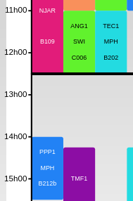

### Description
Ensures that groups {{ groups }} have a break for lunch (or anything else) of at least {{ lunch_length }} minutes between 
{{ start_time }} and {{ end_time }} on {{ week_days }}.
### Examples
| Context                                                                                  |OK                                 | Not Ok|
|------------------------------------------------------------------------------------------|------------------------------------------------------------|--------------------------------------------------------------------|
| groups : All   start_time : 12h30   end_time : 14h    lunch_length : 60 minutes |  | |

### Parameters:
- start_time: minuts from midnight (integer)
- end_time: minuts from midnight (integer)
- lunch_length : minuts (integer)