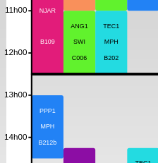

### Description
Garantit que les profs {{ tutors }} ont une pause repas (ou autre) d'au moins {{ lunch_length }} minutes
entre {{ start_time }} et {{ end_time }} les {{ week_days }}.
### Exemples
| Contexte                                                                                 |OK                                 | Not Ok|
|------------------------------------------------------------------------------------------|------------------------------------------------------------|--------------------------------------------------------------------|
| tutors : MPH   start_time : 12h30   end_time : 14h    lunch_length : 60 minutes |  | |

### Paramètres:
- start_time: minutes depuis minuit (entier)
- end_time: minutes depuis minuit (entier)
- lunch_length : minutes (entier)